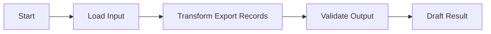

# n8n Workflow WF-B9C51FE7A0

## Workflow ID

WF-B9C51FE7A0

## Name

POD exports

## Category

POD

## Status

JSON Draft Generated

## Purpose

Create an inactive n8n workflow draft that supports: POD exports.

## Inputs

- Operator-supplied records or trigger data
- Manually configured non-secret workflow settings

## Outputs

- Validated internal workflow result
- Draft export data for operator review

## Nodes

| Node | Type | Purpose |
|---|---|---|
| Start | `n8n-nodes-base.scheduleTrigger` | Start only when an operator later imports and explicitly configures the draft. |
| Load Input | `n8n-nodes-base.set` | Define or normalize workflow inputs without embedding secrets. |
| Transform Export Records | `n8n-nodes-base.code` | Transform records into an export-ready structure. |
| Validate Output | `n8n-nodes-base.if` | Check required fields before any downstream handoff. |
| Draft Result | `n8n-nodes-base.set` | Produce an internal draft result only. |

## Required Credentials

- None required by the current draft.

## Risks

- External service schemas may differ from the placeholders.
- A future operator could activate the workflow without completing review.
- Rate limits, privacy rules, and platform terms require manual validation.
- Generated transformation logic is a draft and requires testing in a safe n8n environment.

## Business Use

- Category: POD
- Use the draft as an architecture starting point and review it before manual import.
- Keep platform actions, outreach, publishing, financial actions, and external calls unconfigured.

## Suggested JSON Structure

```json
{
  "name": "Draft - POD exports",
  "active": false,
  "nodes": [
    {
      "id": "WF-B9C51FE7A0-NODE-1",
      "name": "Start",
      "type": "n8n-nodes-base.scheduleTrigger",
      "typeVersion": 1,
      "position": [
        0,
        0
      ],
      "parameters": {},
      "disabled": true
    },
    {
      "id": "WF-B9C51FE7A0-NODE-2",
      "name": "Load Input",
      "type": "n8n-nodes-base.set",
      "typeVersion": 1,
      "position": [
        260,
        0
      ],
      "parameters": {
        "assignments": {
          "assignments": []
        },
        "options": {}
      },
      "disabled": true
    },
    {
      "id": "WF-B9C51FE7A0-NODE-3",
      "name": "Transform Export Records",
      "type": "n8n-nodes-base.code",
      "typeVersion": 1,
      "position": [
        520,
        0
      ],
      "parameters": {
        "jsCode": "// Draft only. Add reviewed transformation logic before manual import.\\nreturn $input.all();"
      },
      "disabled": true
    },
    {
      "id": "WF-B9C51FE7A0-NODE-4",
      "name": "Validate Output",
      "type": "n8n-nodes-base.if",
      "typeVersion": 1,
      "position": [
        780,
        0
      ],
      "parameters": {
        "conditions": {
          "options": {},
          "conditions": [],
          "combinator": "and"
        },
        "options": {}
      },
      "disabled": true
    },
    {
      "id": "WF-B9C51FE7A0-NODE-5",
      "name": "Draft Result",
      "type": "n8n-nodes-base.set",
      "typeVersion": 1,
      "position": [
        1040,
        0
      ],
      "parameters": {
        "assignments": {
          "assignments": []
        },
        "options": {}
      },
      "disabled": true
    }
  ],
  "connections": {
    "Start": {
      "main": [
        [
          {
            "node": "Load Input",
            "type": "main",
            "index": 0
          }
        ]
      ]
    },
    "Load Input": {
      "main": [
        [
          {
            "node": "Transform Export Records",
            "type": "main",
            "index": 0
          }
        ]
      ]
    },
    "Transform Export Records": {
      "main": [
        [
          {
            "node": "Validate Output",
            "type": "main",
            "index": 0
          }
        ]
      ]
    },
    "Validate Output": {
      "main": [
        [
          {
            "node": "Draft Result",
            "type": "main",
            "index": 0
          }
        ]
      ]
    }
  },
  "settings": {
    "executionOrder": "v1"
  },
  "meta": {
    "raphaelWorkflowId": "WF-B9C51FE7A0",
    "draftOnly": true,
    "credentialsStored": false,
    "activationAuthorized": false
  },
  "pinData": {}
}
```

## Workflow Diagram



## JSON Draft

C:\Users\cyber\Downloads\RalphaelOS\Ralphael\00_Raphael\n8n Workflow Studio\Workflow Drafts\WF-B9C51FE7A0 - POD exports.json

## Safety

- Executed: no
- Activated: no
- Credentials stored: no
- External calls made: no
- Source workflows modified: no
