# Workflow Knowledge

Generated: 2026-06-18T04:31:09

## Archive

- Source: `K:\n8n-workflows-main\n8n-workflows-main\workflows`
- Workflow JSON files analyzed: 2054
- Source workflows modified: 0
- Workflows activated: 0
- Workflows executed: 0
- Credential values stored: 0

## Categories

- POD: 5
- Creator: 94
- Agency: 77
- Research: 78
- Knowledge: 167
- Finance: 14
- Notifications: 281
- Executive Briefs: 0
- Marketing: 30
- Automation: 1308

## Common Nodes

- `n8n-nodes-base.stickyNote`: 1322
- `n8n-nodes-base.set`: 1064
- `n8n-nodes-base.httpRequest`: 891
- `n8n-nodes-base.manualTrigger`: 771
- `n8n-nodes-base.if`: 660
- `n8n-nodes-base.code`: 515
- `@n8n/n8n-nodes-langchain.lmChatOpenAi`: 434
- `@n8n/n8n-nodes-langchain.agent`: 379
- `n8n-nodes-base.merge`: 339
- `n8n-nodes-base.scheduleTrigger`: 311
- `n8n-nodes-base.webhook`: 309
- `n8n-nodes-base.splitOut`: 294
- `n8n-nodes-base.googleSheets`: 281
- `n8n-nodes-base.noOp`: 249
- `n8n-nodes-base.switch`: 232
- `n8n-nodes-base.splitInBatches`: 223
- `@n8n/n8n-nodes-langchain.memoryBufferWindow`: 197
- `n8n-nodes-base.filter`: 194
- `@n8n/n8n-nodes-langchain.chainLlm`: 193
- `@n8n/n8n-nodes-langchain.openAi`: 190
- `@n8n/n8n-nodes-langchain.chatTrigger`: 181
- `n8n-nodes-base.executeWorkflowTrigger`: 180
- `n8n-nodes-base.telegram`: 175
- `n8n-nodes-base.aggregate`: 172
- `n8n-nodes-base.gmail`: 167
- `n8n-nodes-base.googleDrive`: 165
- `n8n-nodes-base.respondToWebhook`: 157
- `@n8n/n8n-nodes-langchain.outputParserStructured`: 153
- `n8n-nodes-base.wait`: 149
- `n8n-nodes-base.slack`: 140
- `n8n-nodes-base.function`: 123
- `n8n-nodes-base.extractFromFile`: 118
- `n8n-nodes-base.formTrigger`: 114
- `n8n-nodes-base.airtable`: 113
- `@n8n/n8n-nodes-langchain.lmChatGoogleGemini`: 112
- `n8n-nodes-base.cron`: 108
- `@n8n/n8n-nodes-langchain.toolWorkflow`: 100
- `@n8n/n8n-nodes-langchain.documentDefaultDataLoader`: 99
- `n8n-nodes-base.telegramTrigger`: 92
- `n8n-nodes-base.html`: 85
- `@n8n/n8n-nodes-langchain.textSplitterRecursiveCharacterTextSplitter`: 76
- `n8n-nodes-base.markdown`: 74
- `n8n-nodes-base.emailSend`: 71
- `@n8n/n8n-nodes-langchain.embeddingsOpenAi`: 71
- `@n8n/n8n-nodes-langchain.informationExtractor`: 70
- `n8n-nodes-base.convertToFile`: 70
- `n8n-nodes-base.executeWorkflow`: 67
- `n8n-nodes-base.notion`: 60
- `n8n-nodes-base.limit`: 58
- `n8n-nodes-base.gmailTrigger`: 53

## APIs and Services

- Sticky Note: 1322
- Set: 1064
- Http Request: 891
- Manual Trigger: 771
- If: 660
- Code: 523
- Lm Chat Open Ai: 434
- Agent: 379
- Merge: 339
- Schedule Trigger: 311
- Webhook: 309
- Split Out: 294
- Google Sheets: 281
- No Op: 249
- Switch: 232
- Split In Batches: 223
- Open Ai: 222
- Memory Buffer Window: 197
- Filter: 194
- Chain Llm: 193
- Chat Trigger: 181
- Execute Workflow Trigger: 180
- Telegram: 175
- Aggregate: 172
- Gmail: 167
- Google Drive: 165
- Respond To Webhook: 157
- Output Parser Structured: 153
- Wait: 149
- Slack: 140
- Function: 123
- Extract From File: 118
- Form Trigger: 114
- Airtable: 113
- Lm Chat Google Gemini: 112
- Cron: 108
- Tool Workflow: 100
- Document Default Data Loader: 99
- Telegram Trigger: 92
- Html: 85
- Text Splitter Recursive Character Text Splitter: 76
- Markdown: 74
- Email Send: 71
- Embeddings Open Ai: 71
- Information Extractor: 70
- Convert To File: 70
- Execute Workflow: 67
- Notion: 60
- Limit: 58
- Gmail Trigger: 53

## Reusable Workflow Families

- 11 workflows share: Http Request, Manual Trigger, Set, Sticky Note
- 7 workflows share: Http Request, Manual Trigger, Read Write File, Sticky Note
- 6 workflows share: Open Ai, Respond To Webhook, Sticky Note, Webhook
- 6 workflows share: Agent, Lm Chat Open Ai, Memory Buffer Window, Tool Http Request, Execute Workflow Trigger, Sticky Note
- 5 workflows share: Execute Workflow Trigger, Http Request, Set, Sticky Note
- 5 workflows share: Baserow, Code, Http Request, Manual Trigger, Schedule Trigger, Sticky Note
- 4 workflows share: Function, Manual Trigger
- 4 workflows share: Code, Http Request, Manual Trigger, Sticky Note
- 4 workflows share: Code, Execute Workflow Trigger, Http Request, Set, Sticky Note
- 4 workflows share: Code, If, Respond To Webhook, Set, Ssh, Sticky Note, Switch, Webhook
- 3 workflows share: Function Item, If, Manual Trigger, Uproc
- 3 workflows share: Open Weather Map, Set, Webhook
- 3 workflows share: Code, Google Sheets, Http Request, Manual Trigger, Sticky Note
- 3 workflows share: Agent, Chat Trigger, Lm Chat Open Ai, Memory Buffer Window, Postgres Tool, Sticky Note
- 3 workflows share: Extract From File, Http Request, Manual Trigger, Set, Sticky Note
- 3 workflows share: Chain Llm, Lm Open Ai, Output Parser Structured, Aggregate, Gmail, Gmail Trigger, Google Sheets, Http Request
- 3 workflows share: Open Ai, Respond To Webhook, Sticky Note, Switch, Webhook
- 3 workflows share: Agent, Document Default Data Loader, Embeddings Open Ai, Lm Chat Open Ai, Memory Buffer Window, Text Splitter Recursive Character Text Splitter, Tool Vector Store, Vector Store In Memory
- 3 workflows share: Execute Workflow, Http Request, Respond To Webhook, Set, Sticky Note, Switch, Webhook
- 3 workflows share: Agent, Lm Chat Groq, Memory Buffer Window, Open Ai, Tool Wikipedia, Airtable, Code, Edit Image
- 3 workflows share: Information Extractor, Lm Chat Open Ai, Airtable, Airtable Trigger, Graphql, Remove Duplicates, Schedule Trigger, Set
- 3 workflows share: Email Send, Google Sheets, If, Slack, Typeform Trigger
- 3 workflows share: Airtop, Code, Google Sheets, Manual Trigger
- 3 workflows share: Function
- 3 workflows share: Chain Llm, Chain Summarization, Information Extractor, Lm Chat Open Ai, Output Parser Structured, Extract From File, Form Trigger, Google Drive
- 3 workflows share: Open Ai, Html, Http Request, Respond To Webhook, Sticky Note, Webhook
- 3 workflows share: Baserow, Code, Google Analytics, Http Request, Manual Trigger, Schedule Trigger, Sticky Note
- 3 workflows share: Agent, Chat Trigger, Lm Chat Open Ai, Memory Buffer Window, Tool Http Request, Sticky Note
- 3 workflows share: Email Read Imap, Http Request, Sticky Note
- 3 workflows share: Code, Execute Workflow Trigger, Http Request, If, Set, Sticky Note

## Workflow Relationships

Workflows relate through shared categories, node types, services, triggers, transformations, and credential types.

## Workflow Knowledge Graph

```mermaid
graph TD
    CAT_POD["POD"]
    CAT_Creator["Creator"]
    CAT_Agency["Agency"]
    CAT_Research["Research"]
    CAT_Knowledge["Knowledge"]
    CAT_Finance["Finance"]
    CAT_Notifications["Notifications"]
    CAT_Executive_Briefs["Executive Briefs"]
    CAT_Marketing["Marketing"]
    CAT_Automation["Automation"]
    NODE_0["Sticky Note (1322)"]
    CAT_POD --> NODE_0
    CAT_Creator --> NODE_0
    CAT_Agency --> NODE_0
    CAT_Research --> NODE_0
    NODE_1["Set (1064)"]
    CAT_POD --> NODE_1
    CAT_Creator --> NODE_1
    CAT_Agency --> NODE_1
    CAT_Research --> NODE_1
    NODE_2["Http Request (891)"]
    CAT_POD --> NODE_2
    CAT_Creator --> NODE_2
    CAT_Agency --> NODE_2
    CAT_Research --> NODE_2
    NODE_3["Manual Trigger (771)"]
    CAT_POD --> NODE_3
    CAT_Creator --> NODE_3
    CAT_Agency --> NODE_3
    CAT_Research --> NODE_3
    NODE_4["If (660)"]
    CAT_POD --> NODE_4
    CAT_Creator --> NODE_4
    CAT_Agency --> NODE_4
    CAT_Research --> NODE_4
    NODE_5["Code (515)"]
    CAT_POD --> NODE_5
    CAT_Creator --> NODE_5
    CAT_Agency --> NODE_5
    CAT_Research --> NODE_5
    NODE_6["Lm Chat Open Ai (434)"]
    CAT_POD --> NODE_6
    CAT_Creator --> NODE_6
    CAT_Agency --> NODE_6
    CAT_Research --> NODE_6
    NODE_7["Agent (379)"]
    CAT_POD --> NODE_7
    CAT_Creator --> NODE_7
    CAT_Agency --> NODE_7
    CAT_Research --> NODE_7
    NODE_8["Merge (339)"]
    CAT_POD --> NODE_8
    CAT_Creator --> NODE_8
    CAT_Agency --> NODE_8
    CAT_Research --> NODE_8
    NODE_9["Schedule Trigger (311)"]
    CAT_Creator --> NODE_9
    CAT_Agency --> NODE_9
    CAT_Research --> NODE_9
    CAT_Knowledge --> NODE_9
    NODE_10["Webhook (309)"]
    CAT_POD --> NODE_10
    CAT_Creator --> NODE_10
    CAT_Agency --> NODE_10
    CAT_Research --> NODE_10
    NODE_11["Split Out (294)"]
    CAT_POD --> NODE_11
    CAT_Creator --> NODE_11
    CAT_Agency --> NODE_11
    CAT_Research --> NODE_11
    NODE_12["Google Sheets (281)"]
    CAT_POD --> NODE_12
    CAT_Creator --> NODE_12
    CAT_Agency --> NODE_12
    CAT_Research --> NODE_12
    NODE_13["No Op (249)"]
    CAT_Creator --> NODE_13
    CAT_Agency --> NODE_13
    CAT_Research --> NODE_13
    CAT_Knowledge --> NODE_13
    NODE_14["Switch (232)"]
    CAT_Creator --> NODE_14
    CAT_Agency --> NODE_14
    CAT_Research --> NODE_14
    CAT_Knowledge --> NODE_14
    NODE_15["Split In Batches (223)"]
    CAT_POD --> NODE_15
    CAT_Creator --> NODE_15
    CAT_Agency --> NODE_15
    CAT_Research --> NODE_15
    NODE_16["Memory Buffer Window (197)"]
    CAT_Creator --> NODE_16
    CAT_Agency --> NODE_16
    CAT_Research --> NODE_16
    CAT_Knowledge --> NODE_16
    NODE_17["Filter (194)"]
    CAT_Creator --> NODE_17
    CAT_Agency --> NODE_17
    CAT_Research --> NODE_17
    CAT_Knowledge --> NODE_17
    NODE_18["Chain Llm (193)"]
    CAT_POD --> NODE_18
    CAT_Creator --> NODE_18
    CAT_Agency --> NODE_18
    CAT_Research --> NODE_18
    NODE_19["Open Ai (190)"]
    CAT_POD --> NODE_19
    CAT_Creator --> NODE_19
    CAT_Agency --> NODE_19
    CAT_Research --> NODE_19
    NODE_20["Chat Trigger (181)"]
    CAT_Creator --> NODE_20
    CAT_Agency --> NODE_20
    CAT_Research --> NODE_20
    CAT_Knowledge --> NODE_20
    NODE_21["Execute Workflow Trigger (180)"]
    CAT_Creator --> NODE_21
    CAT_Agency --> NODE_21
    CAT_Research --> NODE_21
    CAT_Knowledge --> NODE_21
    NODE_22["Telegram (175)"]
    CAT_Creator --> NODE_22
    CAT_Agency --> NODE_22
    CAT_Research --> NODE_22
    CAT_Knowledge --> NODE_22
    NODE_23["Aggregate (172)"]
    CAT_POD --> NODE_23
    CAT_Creator --> NODE_23
    CAT_Agency --> NODE_23
    CAT_Research --> NODE_23
    NODE_24["Gmail (167)"]
    CAT_POD --> NODE_24
    CAT_Creator --> NODE_24
    CAT_Agency --> NODE_24
    CAT_Research --> NODE_24
    NODE_25["Google Drive (165)"]
    CAT_Creator --> NODE_25
    CAT_Agency --> NODE_25
    CAT_Research --> NODE_25
    CAT_Knowledge --> NODE_25
    NODE_26["Respond To Webhook (157)"]
    CAT_POD --> NODE_26
    CAT_Creator --> NODE_26
    CAT_Agency --> NODE_26
    CAT_Research --> NODE_26
    NODE_27["Output Parser Structured (153)"]
    CAT_POD --> NODE_27
    CAT_Creator --> NODE_27
    CAT_Agency --> NODE_27
    CAT_Research --> NODE_27
    NODE_28["Wait (149)"]
    CAT_Creator --> NODE_28
    CAT_Agency --> NODE_28
    CAT_Research --> NODE_28
    CAT_Knowledge --> NODE_28
    NODE_29["Slack (140)"]
    CAT_Creator --> NODE_29
    CAT_Agency --> NODE_29
    CAT_Research --> NODE_29
    CAT_Knowledge --> NODE_29
    NODE_30["Function (123)"]
    CAT_POD --> NODE_30
    CAT_Creator --> NODE_30
    CAT_Agency --> NODE_30
    CAT_Research --> NODE_30
    NODE_31["Extract From File (118)"]
    CAT_Creator --> NODE_31
    CAT_Agency --> NODE_31
    CAT_Knowledge --> NODE_31
    CAT_Finance --> NODE_31
    NODE_32["Form Trigger (114)"]
    CAT_Creator --> NODE_32
    CAT_Agency --> NODE_32
    CAT_Knowledge --> NODE_32
    CAT_Finance --> NODE_32
    NODE_33["Airtable (113)"]
    CAT_Creator --> NODE_33
    CAT_Agency --> NODE_33
    CAT_Research --> NODE_33
    CAT_Knowledge --> NODE_33
    NODE_34["Lm Chat Google Gemini (112)"]
    CAT_POD --> NODE_34
    CAT_Creator --> NODE_34
    CAT_Agency --> NODE_34
    CAT_Research --> NODE_34
    NODE_35["Cron (108)"]
    CAT_Creator --> NODE_35
    CAT_Agency --> NODE_35
    CAT_Research --> NODE_35
    CAT_Knowledge --> NODE_35
    NODE_36["Tool Workflow (100)"]
    CAT_Creator --> NODE_36
    CAT_Agency --> NODE_36
    CAT_Research --> NODE_36
    CAT_Knowledge --> NODE_36
    NODE_37["Document Default Data Loader (99)"]
    CAT_Creator --> NODE_37
    CAT_Research --> NODE_37
    CAT_Knowledge --> NODE_37
    NODE_38["Telegram Trigger (92)"]
    CAT_Creator --> NODE_38
    CAT_Agency --> NODE_38
    CAT_Research --> NODE_38
    CAT_Knowledge --> NODE_38
    NODE_39["Html (85)"]
    CAT_Creator --> NODE_39
    CAT_Agency --> NODE_39
    CAT_Research --> NODE_39
    CAT_Knowledge --> NODE_39
```

## Safety Boundary

Analysis was local and read-only. Raphael did not activate, execute, upload, call APIs, store credential values, or modify source workflow files.
