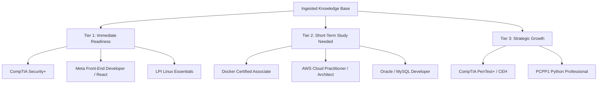

# Certification Action Plan & Gap Analysis

*Generated by Raphael OS Knowledge Engine based on ingested coursework, projects, and codebase artifacts.*

---

## Executive Summary

This Certification Action Plan synthesizes your verified knowledge graph—spanning coursework (`CSC2262`, `CSC3102`, `CSC4101`, `CSC4103`, `CSC4243`, `CSC4402`, `ISDS 4123`), software projects, cryptanalysis tools, and automation pipelines—into a prioritized roadmap of industry-recognized certifications.

---

## 1. Certification Tiering & Readiness Matrix

| Certification | Domain | Estimated Readiness | Primary Ingested Evidence | Key Gap / Study Area |
| :--- | :--- | :---: | :--- | :--- |
| **CompTIA Security+ (SY0-701)** | Cybersecurity | **85%** | `CSC2262` Cryptography, Substitution Cipher Cryptanalysis, OS Security concepts | Governance, Risk & Compliance (GRC), Cloud IAM policies |
| **Meta Front-End Developer Certificate** | Web Engineering | **90%** | `CSC4243`, `Tune Trails React App`, `LCIntel`, `project-bolt-sb1` React / TS | Web accessibility (WCAG), advanced testing (Jest/RTL) |
| **LPI Linux Essentials** | Systems & OS | **85%** | `CSC4103` Operating Systems, PintOS User Programs, C Systems Code | Shell scripting edge-cases & standard Linux CLI utils |
| **Docker Certified Associate (DCA)** | DevOps / Cloud | **75%** | `n8n Workflow Automation Collection`, Docker Compose runtime specs | Swarm mode, enterprise security & registry administration |
| **AWS Cloud Practitioner / Solutions Architect** | Cloud Computing | **70%** | Cloud database concepts (`CSC4402`), Web App Architecture, Docker | AWS native services (S3, EC2, IAM, VPC, Lambda) |
| **Oracle MySQL Database Developer** | Data Systems | **80%** | `CSC4402` Database Management, SQL Scripts, Relational Queries | Stored procedures, triggers, & MySQL-specific tuning |

---

## 2. Detailed Roadmap & Gap Analysis

### 🛡️ 1. CompTIA Security+ (SY0-701)
* **Ingested Foundation:**
  * Cryptographic algorithms, hashing, substitution cipher analysis (`CSC2262`).
  * Low-level OS vulnerability understanding (`CSC4103` PintOS memory management & user programs).
* **Gap Analysis & Preparation:**
  * **Strong in:** Cryptography, Threats/Attacks, Systems Security.
  * **Review Needed:** Security Governance, Compliance frameworks (SOC2, ISO 27001), Network Architecture & Firewalls.
* **Target Timeline:** 2 - 3 Weeks review.

---

### ⚛️ 2. Meta Front-End Developer / OpenJS React Developer
* **Ingested Foundation:**
  * Full React component architectures (`Tune Trails`, `LCIntel`, `bolt-sb1`).
  * JavaScript ES6+, TypeScript, state management, CSS layouts (`CSC4243`).
* **Gap Analysis & Preparation:**
  * **Strong in:** React functional components, hooks, props, responsive layouts.
  * **Review Needed:** Unit testing with React Testing Library, Accessibility (ARIA/WCAG) best practices.
* **Target Timeline:** 1 - 2 Weeks portfolio packaging.

---

### 🐧 3. LPI Linux Essentials / CompTIA Linux+
* **Ingested Foundation:**
  * Deep C & OS internals work in Linux environments (`CSC4103`).
  * Process lifecycle, memory management, file permissions.
* **Gap Analysis & Preparation:**
  * **Strong in:** Kernel basics, process execution, file systems.
  * **Review Needed:** Bash scripting syntax, package managers (apt, yum), network interface setup commands.
* **Target Timeline:** 1 Week brush-up.

---

### 🐳 4. Docker Certified Associate (DCA)
* **Ingested Foundation:**
  * Docker Compose configurations, container runtime manifests across Raphael OS ecosystem and n8n integrations.
* **Gap Analysis & Preparation:**
  * **Strong in:** Container runtime basics, volume binding, Dockerfile construction.
  * **Review Needed:** Docker Swarm orchestration, overlay networking, Docker Trusted Registry management.
* **Target Timeline:** 3 - 4 Weeks.

---

### ☁️ 5. AWS Certified Solutions Architect – Associate
* **Ingested Foundation:**
  * Web applications (`CSC4243`), Database architectures (`CSC4402`), API workflows (`n8n`).
* **Gap Analysis & Preparation:**
  * **Strong in:** Application architecture, relational database queries, system design principles.
  * **Review Needed:** AWS-specific services (IAM roles, VPC subnets, S3 lifecycle rules, ECS/EKS).
* **Target Timeline:** 4 - 6 Weeks focused AWS study.

---

## 3. Recommended Action Plan & Next Steps

1. **Immediate Focus (Month 1):**
   * Take practice exams for **CompTIA Security+** and **LPI Linux Essentials** to validate readiness.
   * Package existing React projects (`Tune Trails`, `LCIntel`) into a public portfolio for Frontend certification verification.
2. **Secondary Focus (Month 2):**
   * Complete targeted AWS & Docker practice modules to bridge cloud-native service gaps.
3. **Vault Integration:**
   * Keep your project notes updated in Raphael OS knowledge base (`09_Knowledge`) to continuously refresh your automated skill maps.
